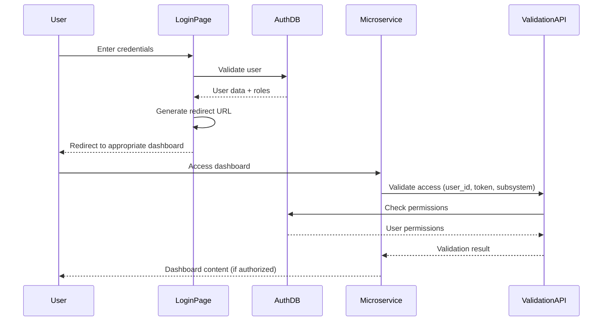

# LGU1 Login System Implementation Summary

## Overview
This document outlines the implementation of the LGU1 authentication system with role-based access control and microservice integration.

## Files Created/Modified

### 1. Login Interface (`public/login.php`)
- **Purpose**: Main authentication interface with consistent UI design
- **Features**:
  - Clean, government-themed design matching register.php
  - Username/email and password authentication
  - Role-based redirection after login
  - Password visibility toggle
  - WiFi status indicator
  - Responsive design with Bootstrap 5

### 2. Dashboard Validation API (`api/dashboard_validation.php`)
- **Purpose**: Central authentication validation for all microservices
- **Features**:
  - User authentication verification
  - Role and permission validation
  - Subsystem access control
  - Audit logging for security
  - JSON API responses
  - CORS support for cross-origin requests

### 3. Microservice Authentication Helper (`api/microservice_auth.php`)
- **Purpose**: PHP class for easy integration with other subsystems
- **Features**:
  - Simple API for validating user access
  - Permission and role checking methods
  - Dashboard URL generation based on roles
  - Error handling and fallback mechanisms

### 4. Example Housing Dashboard (`examples/housing_dashboard.php`)
- **Purpose**: Demonstrates integration with authentication system
- **Features**:
  - Role-based content display
  - Sidebar navigation based on permissions
  - User information display
  - Bootstrap-styled responsive layout

## Authentication Flow



## Role-Based Access Control

### User Roles
Based on the database schema, the following roles are implemented:

1. **Super Admin**
   - Access to all systems and functions
   - User management capabilities
   - System administration

2. **Housing Admin**
   - Housing subsystem access
   - Administrative functions within housing
   - User and report management

3. **Eligibility Officer**
   - Beneficiary verification functions
   - Housing application processing

4. **Resettlement Coordinator**
   - Resettlement project management
   - Coordination activities

5. **Finance Officer**
   - Financial system access
   - Payment and billing functions

6. **Clerk**
   - Document processing
   - Basic administrative tasks

7. **Citizen**
   - Citizen portal access
   - Service applications and tracking

### Redirection Logic
After successful login, users are redirected based on their primary role:

- **Super Admin** → Admin dashboard
- **Housing roles** → Housing subsystem dashboard
- **Citizen** → Citizen portal
- **Others** → Default dashboard

## Microservice Integration

### API Endpoint
```
GET/POST: /api/dashboard_validation.php
Parameters:
- user_id: User ID from login
- token: Base64 encoded username (can be enhanced)
- subsystem: Required subsystem name (optional)
- required_role: Required role (optional)
```

### Example Usage in Housing Subsystem
```php
require_once 'path/to/microservice_auth.php';

$auth = new LGU1Auth();
$validation = $auth->validateAccess(
    $_GET['user_id'], 
    $_GET['token'], 
    'Housing and Resettlement Management'
);

if (!$validation['success']) {
    // Handle access denied
    exit;
}

$user = $validation['user'];
// Continue with dashboard content
```

### URL Format for Microservices
```
http://localhost/LGU1-HousingAndResettlementManagement/dashboard.php?user_id=123&token=dXNlcm5hbWU=
```

## Database Integration

### Key Tables Used
- `users`: Main user information and status
- `roles`: Available system roles
- `user_roles`: User-role assignments
- `subsystems`: Available subsystems
- `user_subsystems`: User-subsystem access
- `permissions`: Granular permissions
- `role_permissions`: Role-permission mapping
- `audit_logs`: Security and access logging

### Housing Subsystem Roles
Currently configured for Housing and Resettlement Management:
- Housing Admin (role_id: 2)
- Eligibility Officer (role_id: 3)
- Resettlement Coordinator (role_id: 4)

## Security Features

1. **Password Verification**: Uses PHP's `password_verify()` for secure authentication
2. **Audit Logging**: All login attempts and access requests are logged
3. **Status Checking**: Only active, email-verified users can login
4. **Token Validation**: Simple token system for cross-service authentication
5. **CORS Headers**: Proper cross-origin support for API requests

## Deployment Considerations

### Current Setup (Development)
- Base URL: `http://localhost/LGU1-LOGIN`
- Housing URL: `http://localhost/LGU1-HousingAndResettlementManagement`

### Production Deployment
1. Update base URLs in authentication helper
2. Implement stronger token generation (JWT recommended)
3. Enable HTTPS for all authentication endpoints
4. Configure proper CORS policies
5. Set up monitoring for audit logs

## Error Handling

The system provides specific error codes for different scenarios:
- `USER_NOT_FOUND`: Invalid or inactive user
- `INVALID_TOKEN`: Authentication token mismatch
- `SUBSYSTEM_ACCESS_DENIED`: User lacks subsystem permissions
- `ROLE_ACCESS_DENIED`: User lacks required role
- `DATABASE_ERROR`: System/database issues
- `AUTH_SERVICE_UNAVAILABLE`: API connection failures

## Super Admin Features

### Super Admin API Gateway (`api/super_admin_gateway.php`)
- **Purpose**: Centralized access to all subsystem databases
- **Features**:
  - Database statistics across all subsystems
  - Direct SQL query execution (SELECT only for security)
  - Table structure viewing
  - Real-time connection status monitoring
  - Comprehensive audit logging

### Super Admin Dashboard (`admin/super_admin_dashboard.php`)
- **Purpose**: Unified control panel for all LGU1 systems
- **Features**:
  - System overview with live statistics
  - Subsystem management interface
  - Database query tool with GUI
  - User management (planned)
  - Audit log viewer (planned)

### API Configuration (`config/api-config.php`)
- **Purpose**: Environment-specific configuration management
- **Features**:
  - Development, staging, and production configurations
  - Easy URL updates for deployment
  - Database connection configurations
  - Helper functions for URL building

## API Endpoints for Super Admin

### 1. Get System Statistics
```
GET: /api/super_admin_gateway.php?action=stats&user_id={id}&token={token}
Returns: Statistics for all subsystems including table counts and connection status
```

### 2. List All Subsystems
```
GET: /api/super_admin_gateway.php?action=list_subsystems&user_id={id}&token={token}
Returns: List of all available subsystems with their API URLs
```

### 3. Execute Database Query
```
POST: /api/super_admin_gateway.php
Body: action=query&user_id={id}&token={token}&subsystem={key}&query={sql}
Returns: Query results (SELECT queries only)
```

### 4. View Subsystem Tables
```
GET: /api/super_admin_gateway.php?action=tables&user_id={id}&token={token}&subsystem={key}
Returns: Table structure and row counts for specified subsystem
```

## Deployment Instructions

### For Production Deployment:

1. **Update Environment Configuration**:
   ```php
   // In config/api-config.php
   $environment = 'production'; // Change from 'development'
   ```

2. **Configure Production URLs**:
   - Update the 'production' section in `config/api-config.php`
   - Replace localhost URLs with actual domain names
   - Update database credentials

3. **Security Enhancements**:
   - Enable HTTPS for all endpoints
   - Implement JWT tokens instead of base64 encoding
   - Set up proper CORS policies
   - Configure rate limiting

### Example Production Configuration:
```php
'production' => [
    'base_url' => 'https://auth.lgu1.gov.ph',
    'subsystems' => [
        'housing' => [
            'name' => 'Housing and Resettlement Management',
            'url' => 'https://housing.lgu1.gov.ph',
            'dashboard_url' => 'https://housing.lgu1.gov.ph/dashboard.php',
            'db_config' => [
                'host' => 'db-cluster.lgu1.gov.ph',
                'dbname' => 'lgu1_housing_prod',
                'username' => 'housing_user',
                'password' => 'secure_password'
            ]
        ]
        // ... other subsystems
    ]
]
```

## Next Steps

1. **Enhanced Security**: Implement JWT tokens for better security
2. **Session Management**: Add session timeout and management
3. **Password Reset**: Complete password reset functionality
4. **Multi-factor Authentication**: Add 2FA for admin roles
5. **API Rate Limiting**: Prevent abuse of authentication endpoints
6. **Monitoring Dashboard**: Create admin interface for monitoring access logs
7. **Database Backup Integration**: Add backup management for all subsystems
8. **Real-time Monitoring**: Implement WebSocket connections for live updates

## Testing

### Test User Creation
To test the system, create users with appropriate roles:

```sql
-- Example: Housing Admin user
INSERT INTO user_roles (user_id, role_id) VALUES (user_id, 2);
INSERT INTO user_subsystems (user_id, subsystem_id) VALUES (user_id, 8);
```

### API Testing
```bash
# Test validation endpoint
curl "http://localhost/LGU1-LOGIN/api/dashboard_validation.php?user_id=1&token=base64_username&subsystem=Housing%20and%20Resettlement%20Management"
```

This implementation provides a solid foundation for the LGU1 microservices architecture with proper authentication, authorization, and audit capabilities.
